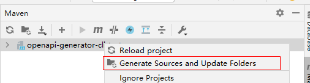
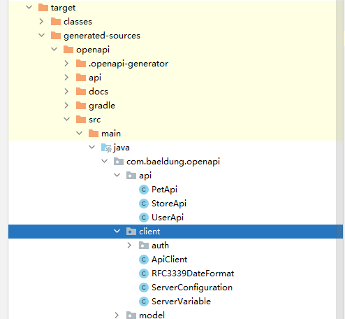

# openapi-generator-cli-resttemplate

#### 介绍
生成resttemplate风格调用的client

#### 使用说明

一:使用idea 的maven generate sources and update folders

生成后效果如图

二:使用mvn命令

`mvn clean generate-sources`

#### 参考

参考文章:[Open API Server Implementation Using OpenAPI Generator](https://www.baeldung.com/java-openapi-generator-server)

参考项目:[eugenp/tutorials/tree/master/spring-boot-modules/spring-boot-libraries-2](https://github.com/eugenp/tutorials/tree/master/spring-boot-modules/spring-boot-libraries-2)

#### 其它
petstore.json取自 swagger-demo https://petstore.swagger.io/ 的network中swagger.json复制到本地
其swagger接口可以提供服务，在com.baeldung.openapi.test.ApiTestWithSpring 中可以进行测试